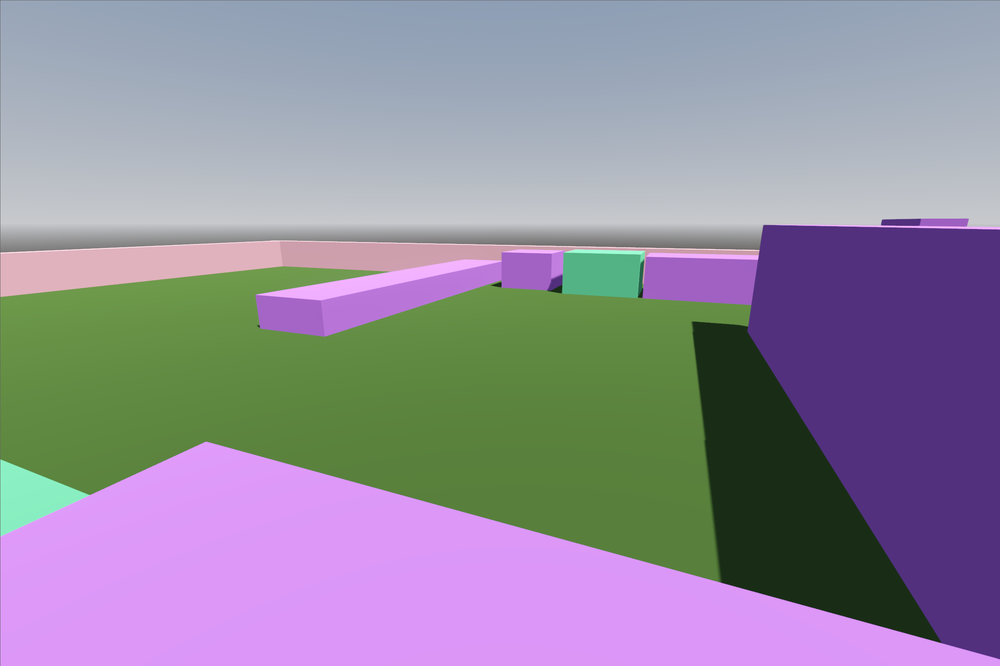
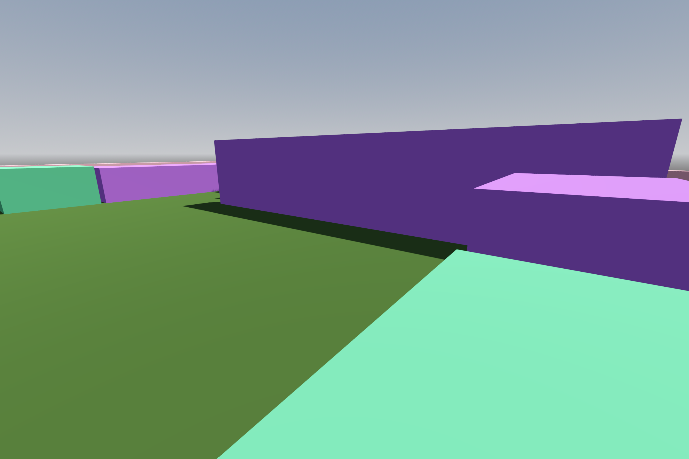
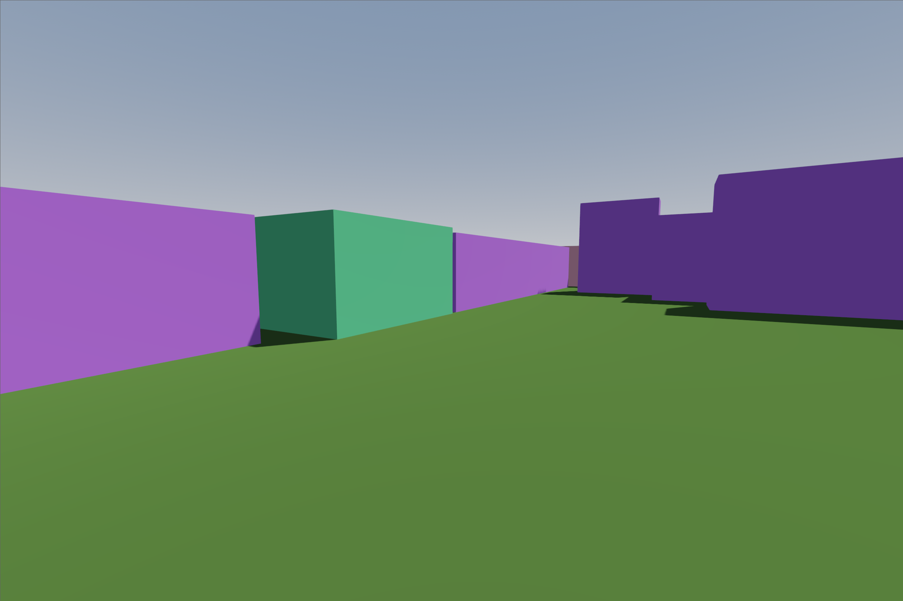

# Proyecto de Simulación de VR para Móvil con Entorno 3D

## Objetivo

Desarrollar una simulación de realidad virtual (VR) para dispositivos móviles utilizando un entorno 3D.

## Desarrollo

### 1. Buscar Recursos

Recursos para el proyecto fueron obtenidos desde [itch.io Game Assets](https://itch.io/game-assets).

### 2. Guía de Desarrollo

Se siguió la guía oficial de Godot para comenzar con VR, disponible en: [VR Starter Tutorial](https://docs.godotengine.org/en/3.1/tutorials/vr/vr_starter_tutorial.html).

### 3. Exportar el Proyecto a Móvil

#### Android

El proyecto fue exportado a Android siguiendo las instrucciones en: [Exporting for Android](https://docs.godotengine.org/en/stable/tutorials/export/exporting_for_android.html).

#### iOS

Alternativamente, el proyecto se puede exportar a iOS siguiendo las instrucciones en: [Exporting for iOS](https://docs.godotengine.org/en/stable/tutorials/export/exporting_for_ios.html).

## Entrega

- **Enlace al Repositorio Público del Proyecto**: [Enlace al repositorio]

- **Impresiones de Pantalla del Proyecto Funcionando**:
  
  
  

- **Ejecutable de Android (.aab)**:

  - Se encuentra en la carpeta `Ejecutable` dentro del repositorio.

- **Video (para proyectos en iOS)**:
  - [Enlace al video demostrativo] (para proyectos exportados a iOS).

## Bibliografía

- Tutorial de desarrollo de VR en Godot: [YouTube Playlist](https://www.youtube.com/watch?v=fxZoXfX4oBo&list=PLfX6C2dxVyLxXl3gJwakzdqRaV7WKlqFR)

---

## Cómo clonar y ejecutar el proyecto

### Requisitos

- Godot Engine versión 3.1 o superior
- SDK de Android o Xcode para iOS
- Dispositivo móvil compatible

### Pasos

1. Clona este repositorio:

   ```bash
   git clone [enlace al repositorio]
   ```

2. Abre el proyecto en Godot.

3. Sigue las instrucciones de la guía para [exportar a Android](https://docs.godotengine.org/en/stable/tutorials/export/exporting_for_android.html) o [exportar a iOS](https://docs.godotengine.org/en/stable/tutorials/export/exporting_for_ios.html).

4. Compila y ejecuta el proyecto en tu dispositivo móvil.

---
